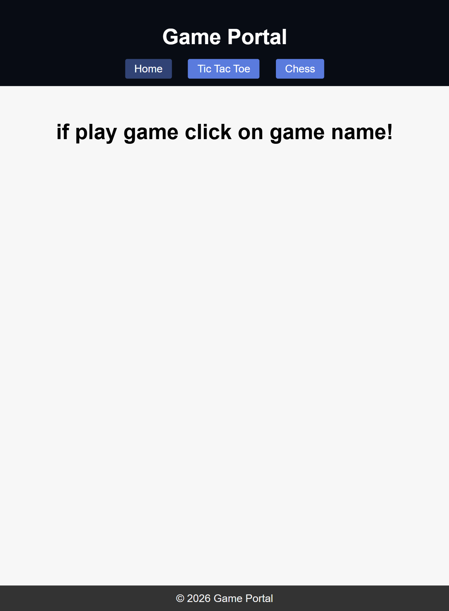
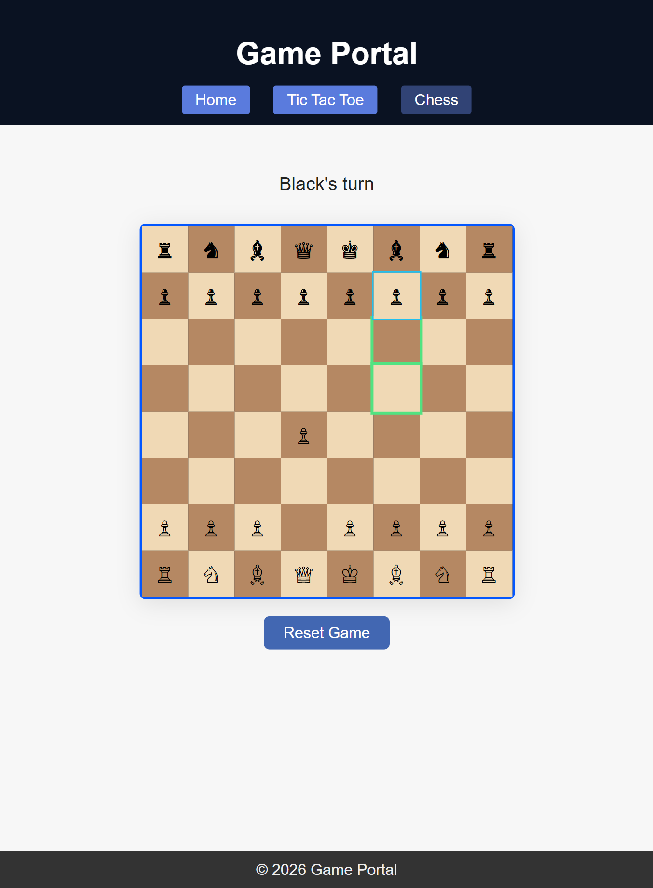
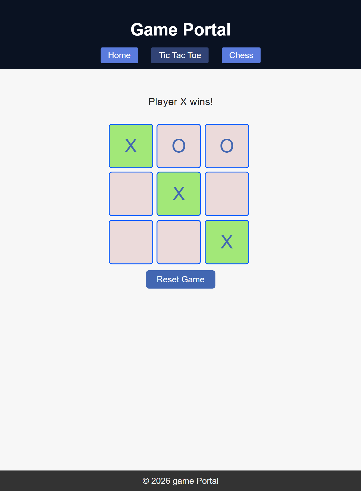

# Game Folder

This folder contains a simple browser-based game portal with three HTML pages:

## Files

- `index.html` — the home page for the portal.
- `tictactoe.html` — the Tic Tac Toe game page.
- `chess.html` — the Chess game page.

## How to use

1. Open `index.html` in a browser to access the portal.
2. Use the navigation links to switch between:
   - Home
   - Tic Tac Toe
   - Chess
3. Each game page is designed to run directly in the browser without any build step or installation.

## Notes

- The games are static HTML files with embedded styling and JavaScript.
- No package manager or server setup is required.
- To view the games locally, you can open the HTML files directly in your browser or serve the folder from a local web server.

## Suggested next steps

- Add a short description for each game on the home page.
- Add score tracking or game history.
- Improve the chess implementation with clearer move validation and UI feedback.

## Screenshots

## Portal Game

## Chess Game

## Tic-Tac-Toe Page

